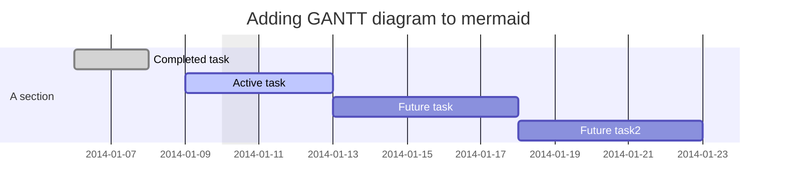
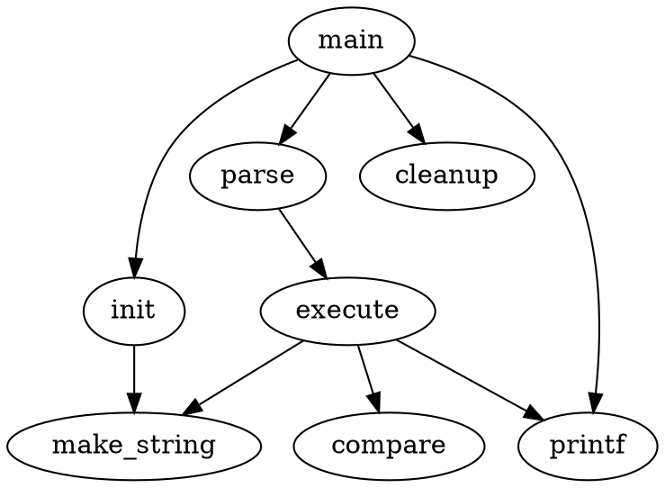

# 2020-06-29-markdown-cheatsheet

## Complete Markdown Cheatsheet

Common Mark Implementation

## 1. Basic Markdown

### 1.1. Heading

_Support: all markdown flavour_ _**Syntaxes**_

```text
# h1 Heading
## h2 Heading
### h3 Heading
#### h4 Heading
##### h5 Heading
###### h6 Heading
```

_**Showcases**_

## h1 Heading

### h2 Heading

#### h3 Heading

**h4 Heading**

**h5 Heading**

**h6 Heading**

_**Syntaxes**_

```text
h1 Heading
===================
h2 Heading
-------------------
```

_**Showcases**_

## h1 Heading

### h2 Heading

_Notes:_

* Always put a space between `#` and the heading name
* Heading with  `===` or `---` are not recommended

### 1.2. Paragraphs

_Notes:_

* To create paragraphs, use a blank line to separate one or more lines of text.
* Don't ident paragraphs with spaces or tabs

_**Syntaxes**_

```text
This is the first paragraph.

This is the second paragraph
```

_**Showcases**_

This is the first paragraph.

This is the second paragraph

### 1.3 Line Break

_Notes:_

* To create a line break, end a line with two or more spaces, and then type return
* _Or_ use the `<br>` HTML tag

_**Syntaxes**_

```text
This is the first line.  
And this is the second line.
```

_**Showcases**_

This is the first line.  
And this is the second line.

_**Alternative Syntaxes**_

```text
First line with the HTML tag after.<br>
And the next line.
```

_**Showcases**_

First line with the HTML tag after.  
 And the next line.

### 1.4. Emphasis

_**Syntaxes**_

```text
**This is bold text**
__This is bold text__
*This is italic text*
_This is italic text_
We have **bold***italic*
This text is ***really important***
This text is ___really important___
This text is __*really important*__
This text is **_really important_**
```

_**Showcases**_

**This is bold text** **This is bold text** _This is italic text_ _This is italic text_ We have **bold\***italic _This text is \*\*_really important _**This text is really important This text is \_\_**_**really important\*\_\_ This text is** _really important_\*\*

### 1.5. Blockquotes

_Notes:_

* Space is needed after the marker `>`;
* You could just add only one `>` at the first line;
* Blockquotes can be nested
* Blockquotes can contain multiple paragraphs. Add a &gt;  between the paragraphs.
* Blockquotes can contain other Markdown formatted elements. But not all elements can be used.

_**Syntaxes**_

```text
> Blockquotes can also be nested...
>> ...by using additional greater-than signs right next to each other...
> > > ...or with spaces between arrows.
```

_**Showcases**_

> Blockquotes can also be nested...
>
> > ...by using additional greater-than signs right next to each other...
> >
> > > ...or with spaces between arrows.

_**Syntaxes**_

```text
> Dorothy followed her through many of the beautiful rooms in her castle.
>
> The Witch bade her clean the pots and kettles and sweep the floor and keep the fire fed with wood.
```

_**Showcases**_

> Dorothy followed her through many of the beautiful rooms in her castle.
>
> The Witch bade her clean the pots and kettles and sweep the floor and keep the fire fed with wood.

_**Syntaxes**_

```text
> #### The quarterly results look great!
>
> - Revenue was off the chart.
> - Profits were higher than ever.
>
>  *Everything* is going according to **plan**.
```

_**Showcases**_

> **The quarterly results look great!**
>
> * Revenue was off the chart.
> * Profits were higher than ever.
>
>   _Everything_ is going according to **plan**.

### 1.6. Lists

#### 1.6.1. Unordered

_**Syntaxes**_

```text
+ To start a list, there should be an empty line above
+ Create a list by starting a line with `+`, `-`, or `*`
- Changing the sign will add a linespace
+ Add text under an item  
This is a text under an item. Notice that there are two spaces at the end above.
- Sub-lists are made by indenting 2 spaces:
  * Item 2a
  * Item 2b
* Item 3

To end a list, there should be one empty line above.
```

_**Showcases**_

* To start a list, there should be an empty line above
* Create a list by starting a line with `+`, `-`, or `*`
* Changing the sign will add a linespace
* Add text under an item  

  This is a text under an item. Notice that there are two spaces at the end above.

* Sub-lists are made by indenting 2 spaces:
  * Item 2a
  * Item 2b
* Item 3

To end a list, there should be one empty line above.

#### 1.6.2. Ordered

_**Syntaxes**_

```text
1. Item 1
1. Item 2  
Notice that the sequence number is irrelevant. 
Markdown will change the sequence automatically when renderring. 
Notice that there are two spaces at the end above to make a new text under item.
3. Sub-lists are made by indenting 4 spaces
    1. Item 3a
    2. Item 3b
8. Any number for item 4
```

_**Showcases**_

1. Item 1
2. Item 2  

   Notice that the sequence number is irrelevant.  

   Markdown will change the sequence automatically when renderring.  

   Notice that there are two spaces at the end above to make a new text under item.

3. Sub-lists are made by indenting 4 spaces
   1. Item 3a
   2. Item 3b
4. Any number for item 4

_**Syntaxes**_

```text
57. will started with offset 57
1. so it will be 58
```

_**Showcases**_

1. will started with offset 57
2. so it will be 58

### 1.7. Elements in Lists

_Notes:_

* To add another element in a list while preserving the continuity of the list, indent the element four spaces or one tab

_**Syntaxes**_

```text
* This is the first list item.
* Here's the second list item.
    I need to add another paragraph below the second list item.
* And here's the third list item.
```

_**Showcases**_

* This is the first list item.
* Here's the second list item.

  I need to add another paragraph below the second list item.

* And here's the third list item.

_**Showcases**_

* This is the first list item.
* Here's the second list item.

  I need to add another paragraph below the second list item.

* And here's the third list item.

_**Showcases**_

* This is the first list item.
* Here's the second list item.

  > A blockquote would look great below the second list item.

* And here's the third list item.

_**Syntaxes**_

```text
1.  Open the file containing the Linux mascot.
2.  Linux mascot called Tux.
    
3.  Tux is cool.
```

_**Showcases**_

1. Open the file containing the Linux mascot.
2. Linux mascot called Tux.

   

3. Tux is cool.

_But, for text element in ordered list, add five spaces_

1. This is the first list item.
2. Here's the second list item.

   I need to add another paragraph below the second list item.

3. And here's the third list item.

_But, for quote in ordered list, add five spaces_

1. This is the first list item.
2. Here's the second list item.

   > A blockquote would look great below the second list item.

3. And here's the third list item.

_But, for code blocks in the lists, add eight spaces or two tabs._

1. Open the file.
2. Find the following code block on line 21:

   ```text
   <html>
     <head>
       <title>Test</title>
     </head>
   ```

3. Update the title to match the name of your website.

### 1.8. Code

_Notes:_

* Inline codes is written inside \` \`
* or idented by add four spaces or one tab before

_**Syntaxes**_

```text
This is inline `code`.
```

_**Showcases**_

This is inline `code`.

_**Syntaxes**_

```text
    // Some comments
    line 1 of code
    line 2 of code
    line 3 of code
```

_**Showcases**_

```text
// Some comments
line 1 of code
line 2 of code
line 3 of code
```

_**Syntaxes**_

```text
    <html>
      <head>
        <title>Test</title>
      </head>
```

_**Showcases**_

```text
<html>
  <head>
    <title>Test</title>
  </head>
```

### 1.9. Links

**Example**

This is [link](http://example.com/) This is [link with title](http://example.com/)

_Or, directly put the link_

[http://example.com/](http://example.com/) fake@example.com

_Or with `<>`_

[https://www.markdownguide.org](https://www.markdownguide.org) [fake@example.com](mailto:fake@example.com)

_But, to prevent automated linking_

`http://www.example.com`

_Or add emphasize_

I love supporting the [**EFF**](https://eff.org). This is the [_Markdown Guide_](https://www.markdownguide.org). See the section on [`code`](2020-06-29-markdown-cheatsheet.md#code).

### 1.11. Reference-style Links

I know [Indonesia](https://en.wikipedia.org/wiki/Indonesia) I also know [etymology of Indonesia](https://en.wikipedia.org/wiki/Indonesia#Etymology) I knew [History of Indonesia](https://en.wikipedia.org/wiki/Indonesia#History)

_Or, put reference in text_

It was a [hobbit-hole](https://en.wikipedia.org/wiki/Hobbit#Lifestyle), and that means comfort.

_But, be careful with spaces in the links, put `%20` as space_

[example %20 link](https://www.example.com/my%20great%20page) [example without %20](https://www.example.com/my%20great%20page)

### 1.10. Images

_Notes:_

* It is not recommended to use image links in reference format. Some apps will not preview those images.
* Specifying size of image is supported only in some extended markdown \(such as _markdown-it_\).

_**Syntaxes**_

```text


```

_**Showcases**_

 !\[Wikipedia\]\([https://upload.wikimedia.org/wikipedia/commons/thumb/d/de/Wikipedia\_Logo\_1.0.png/240px-Wikipedia\_Logo\_1.0.png](https://upload.wikimedia.org/wikipedia/commons/thumb/d/de/Wikipedia_Logo_1.0.png/240px-Wikipedia_Logo_1.0.png) "Wikipedia logo with specific size" =60x60\)

_**Syntaxes**_

```text
![Image Alt Text][id1]
![Image Alt Text][id2]
```

_**Showcases**_

 

### 1.11. Escaping Characters

_Note:_

* add a backslash `\` in front of the character.

**Example**

\* star \ backslash itself \` backtick { } curly braces ! exclamation mark

### 1.12. HTML Code

**Example**

This **word** is bold. This _word_ is italic.

### 1.13. Horizontal Rules

**Example**

## 2. Extended Markdown

### 2.1. Heading ID

Support: Markdown Extra , Maruku, kramdown

Markdown:

```text
### My Great Heading {#heading-ids}
```

Markdown

#### My Great Heading <a id="heading-ids"></a>

In HTML:

#### My Great Heading <a id="heading-ids"></a>

Link to [Heading IDs](2020-06-29-markdown-cheatsheet.md#heading-ids)

### 2.2. Code Fencing and Highlighting

_Notes:_

* We can make block code fences without need to be idented
* `lang` is optional to specify the language of the code; if not specified, the app won't highlight the code;
* We need one empty line before

_**Syntaxes**_

```text

```

```text
This is a fenced code block.
```
```

```text
***Syntaxes***
```

```text
    This is another fenced code block.
```

```text
***Showcases***
```

This is a fenced code block.

```text
~~~
No language indicated, so no syntax highlighting.
s = "There is no highlighting for this."
But let's throw in a <b>tag</b>.
~~~


***Showcases*** (`javascript`)

```javascript
var s = "JavaScript syntax highlighting";
alert(s);
```

_**Showcases**_ \(`python`\)

```python
def function():
    #indenting works just fine in the fenced code block
    s = "Python syntax highlighting"
    print s
```

_**Showcases**_ \(`ruby`\)

```ruby
require 'redcarpet'
markdown = Redcarpet.new("Hello World!")
puts markdown.to_html
```

### 2.3. Tables

_Notes:_

* we can set alignment in table with a colon \(:\)
* we can add formatting text, links, code and HTML character code, but not: heading, headings, blockquotes, lists, horizontal rules, images, HTML tags, or fenced code

_**Syntaxes**_

```text
| Option | Description |
| ------ | ----------- |
| data   | path to data files to supply the data that will be passed into templates. |
| engine | engine to be used for processing templates. Handlebars is the default. |
| ext    | extension to be used for dest files. |
```

_**Showcases**_

| Option | Description |
| :--- | :--- |
| data | path to data files to supply the data that will be passed into templates. |
| engine | engine to be used for processing templates. Handlebars is the default. |
| ext | extension to be used for dest files. |

_**Syntaxes**_

```text
| Syntax      | Description | Test Text is long    |
| :---        |    :----:   |          ---: |
| Header from      | Title       | Here's this  is |
| Paragraph   | Text        | And more   |
```

_**Showcases**_

| Syntax | Description | Test Text is long |
| :--- | :---: | ---: |
| Header from | Title | Here's this  is |
| Paragraph | Text | And more |

_**Syntaxes**_

```text
| Syntax      | Description | Test Text is long    |
| :---        |    :----:   |          ---: |
| [Example](https://www.example.com/)      | **Title**       | `Here's this  is` |
| Paragraph   | Text        | And more   |
```

_**Showcases**_

| Syntax | Description | Test Text is long |
| :--- | :---: | ---: |
| [Example](https://www.example.com/) | **Title** | `Here's this  is` |
| Paragraph | Text | And more |

### 2.4. Footnote

**Example: The First Part** Here's a simple footnote, and here's a longer one,, and 

**Example: The Second Part** : This is the first footnote. : Here's one with multiple paragraphs. For example like this : `code` or code in paragrahps `code and codes`

_Or add inline footnote_ Another example of footnote 1 link and footnote 2 link. Or to add inline footnote^\[Text of inline footnote\] definition.

_Or duplictade reference_ This duplicated footnote reference.

and multiple paragraphs. : Another footnote text.

### 2.4. Strikethrough, Highlighting, Underline

**Example of strikethrough** ~~strikethrough~~ In HTML: strikethrough

**Example of mark/highlighting** ==marked text== in HTML: marked text

**Example of underline** _underline_ in HTML: underline

### 2.5. Task Lists

**Example**

* [x] Write the press release
* [ ] Update the website
* [ ] Contact the media

### 2.6. Definition Lists

**Example**

First Term : This is the definition of the first term.

Second Term : This is one definition of the second term. : This is another definition of the second term.

In HTML:

First TermThis is the definition of the first term.Second TermThis is one definition of the second term.This is another definition of the second term.

_Or_ 

Term 1 : Definition 1 with lazy continuation.

Term 2 with _inline markup_ : Definition 2 { some code, part of Definition 2 }

```text
Third paragraph of definition 2.
```

_Or in compact style:_

Term 1 ~ Definition 1

Term 2 ~ Definition 2a ~ Definition 2b

### 2.7. Emojies

**Emoji can be copy pasted**

Gone camping! ⛺ Be back soon. That is so funny! 😂

_Or, use markdown_

Gone camping! :tent: Be back soon. That is so funny! :joy:

> Classic markup: :wink: :crush: :cry: :tear: :laughing: :yum:
>
> Shortcuts \(emoticons\): :-\) :-\( 8-\) ;\)

### 2.9. Typographic replacements

**Example**

\(c\) \(C\) \(r\) \(R\) \(tm\) \(TM\) \(p\) \(P\) +- test.. test... test..... test?..... test!.... !!!!!! ???? ,, -- --- "Smartypants, double quotes" and 'single quotes'

### 2.10. Superscript and Subscript

**Example Superscript** x^2^ In HTML: x2

**Example Subscript** H~2~O In HTML: H2O

### 2.11. Inserted Text

**Example** ++Inserted text++ In HTML: This text has been inserted

### 2.12. Abbreviations

**Example**

The "HTML" specification is maintained by the "W3C". _\[HTML\]: Hyper Text Markup Language_ \[W3C\]: World Wide Web Consortium

In HTML: The HTML specification is maintained by the W3C.

### 2.13. HTML Entities and Character Codes

**Example**

© & ¨ ™ ¡ £ & &lt; &gt; ¥ € ® ± ¶ § ¦ ¯ « · \|

_Or_

X² Y³ ¾ ¼ × ÷ »

_Or_

18ºC " '

### 2.14. Latex

_Note:_

* Sometimes with `\(` and `\)` brackets

**Example**

$E=mc^2$

$$\(\sqrt{3x-1}+(1+x)^2\)$$

$$\sin(\alpha)^{\theta}=\sum_{i=0}^{n}(x^i + \cos(f))$$

_Or, inline_

The Gamma function satisfying $\Gamma\(n\) = \(n-1\)!\quad\forall n\in\mathbb N$ is via the Euler integral

### 2.15. Mentions, Tag, Font Awesome

_Note:_

* with `fa-something`:

**Example**

This is @mentions This is \#tags This is ~~tags~~ This is font awesome :fa-star:

### 2.16. Diagram

_Notes:_

* Your app should support the specific library or engine to draw the diagram
* You should specify particular language of the fenced code block and write the definition of your diagram within it.

#### 2.16.1 Mermaid

_Notes:_

* It's implemented in showdown-mermaid.js
* Rendering diagrams of Flowchart or Sequence or Gantt
* Using [mermaid](https://github.com/knsv/mermaid)
* Check [mermaid doc](https://mermaidjs.github.io) for more information.
* Code inside `{ }` is optional

_**Syntaxes**_

* Flowchart syntax:

  ```text
    ```mermaid {"align": "left | center | right", "codeblock": true | false}
    graph TD;
    <code content>
    ```
  ```

* Sequence diagram syntax:

  ```text
    ```mermaid {"align": "left | center | right", "codeblock": true | false}
    sequenceDiagram
    <code content>
    ```
  ```

* Gantt diagram syntax:

  ```text
    ```mermaid {"align": "left | center | right", "codeblock": true | false}
    gantt
    <code content>
    ```
  ```

_**Showcases**_

* Flowchart

\`\`\`mermaid {"align":"center", "codeblock": true} graph TD; A--&gt;B; A--&gt;C; B--&gt;D; C--&gt;D;

```text


* Sequence diagram

\`\`\`mermaid {"align":"right"} sequenceDiagram participant Alice participant Bob Alice-&gt;&gt;John: Hello John, how are you? loop Healthcheck John-&gt;&gt;John: Fight against hypochondria end Note right of John: Rational thoughts   
prevail! John--&gt;&gt;Alice: Great! John-&gt;&gt;Bob: How about you? Bob--&gt;&gt;John: Jolly good!

```text
- Gantt diagram



#### 2.16.2 Plantuml

_Notes:_

* It's implemented in showdown-plantuml.js, 
* Render diagrams of uml,
* Using [plantuml](http://plantuml.com),
* Check [plantuml website](http://plantuml.com/) fpr more information.
* Code inside `{ }` is optional

_**Syntaxes**_

```text
```plantuml {"align": "left | center | right", "codeblock": true | false}
@startuml
<code content>
@enduml
```
```

_**Showcases**_

\`\`\`plantuml {"align":"right"} @startuml participant User

```text
  User -> A: DoWork
  activate A

  A -> B: << createRequest >>
  activate B

  B -> C: DoWork
  activate C
  C --> B: WorkDone
  destroy C

  B --> A: RequestCreated
  deactivate B

  A -> User: Done
  deactivate A

  @enduml
```

```text
### 2.16.3 Flowchart
*Notes:*
- It's implemented in showdown-flowchart.js
- Render diagrams of flowchart
- Using [flowchart.js](https://github.com/adrai/flowchart.js)
- Check [flowchart website](http://flowchart.js.org/) for more information.
- Code inside `{ }` is optional

***Syntaxes***

    ```flow {"align": "left | center | right", "codeblock": true | false}
    <code content>
```

_**Syntaxes**_

```text
```flowchart {"align": "left | center | right", "codeblock": true | false}
<code content>
```
```

_**Showcases**_

\`\`\`flow {"align":"center"} st=&gt;start: Start:&gt;[http://www.google.com\[blank](http://www.google.com[blank)\] e=&gt;end:&gt;[http://www.google.com](http://www.google.com) op1=&gt;operation: My Operation sub1=&gt;subroutine: My Subroutine cond=&gt;condition: Yes or No?:&gt;[http://www.google.com](http://www.google.com) io=&gt;inputoutput: catch something... para=&gt;parallel: parallel tasks

st-&gt;op1-&gt;cond cond\(yes\)-&gt;io-&gt;e cond\(no\)-&gt;para para\(path1, bottom\)-&gt;sub1\(right\)-&gt;op1 para\(path2, top\)-&gt;op1

```text
***Showcases***

```flowchart {"align":"right"}
st=>start: Start
e=>end
op1=>operation: My Operation
sub1=>subroutine: My Subroutine
cond=>condition: Yes
or No?:>http://www.google.com
io=>inputoutput: catch something
st->op1->cond
cond(yes)->io->e
cond(no)->sub1(right)->op1
```

#### 2.16.4 Graphviz's dot

_Notes:_

* It's implemented in showdown-viz.js
* Render diagrams of graphviz's dot 
* Using [viz.js](https://github.com/mdaines/viz.js).
* Code inside `{ }` is optional

_**Syntaxes**_

The \ of json's "engine" field value is 'circo', 'dot', 'neato', 'osage', 'twopi' in syntax language attribute.

```text
```dot {"engine": "<engine name>", "align": "<align>"}
<code content>
```
```

_**Showcases**_

* Dot example with dot engine:

\`\`\`dot {"engine":"dot", "align":"center"} digraph G { main -&gt; parse -&gt; execute; main -&gt; init; main -&gt; cleanup; execute -&gt; make\_string; execute -&gt; printf init -&gt; make\_string; main -&gt; printf; execute -&gt; compare; }

```text
<br>

- Dot example with circo engine:



#### 2.16.5 Railroad diagrams

_Notes:_

* It's implemented in showdown-viz.js, 
* Render diagrams of railroad 
* Using [railroad-diagrams](https://github.com/tabatkins/railroad-diagrams).
* Code inside `{ }` is optional

_**Syntaxes**_

```text
```railroad {"align": "left | center | right", "codeblock": true | false}
<code content>
```
```

_**Showcases**_

\`\`\`railroad {"align":"center"} Diagram\( Optional\('+', 'skip'\), Choice\(0, NonTerminal\('name-start char'\), NonTerminal\('escape'\)\), ZeroOrMore\( Choice\(0, NonTerminal\('name char'\), NonTerminal\('escape'\)\)\)\)

```text
### 2.16.6 WaveDrom
*Notes:*
- It's implemented in showdown-viz.js, 
- Render diagrams of wavedrom 
- Using [wavedrom](https://github.com/wavedrom/wavedrom)
- Check [wavedrom website](https://wavedrom.com) for more information.
- Code inside `{ }` is optional

***Syntaxes***

    ```wavedrom {"align": "left | center | right", "codeblock": true | false}
    <code content>
```

_**Showcases**_

\`\`\`wavedrom {"align":"center"} {signal: \[ {name: 'clk', wave: 'p.....\|...'}, {name: 'dat', wave: 'x.345x\|=.x', data: \['head', 'body', 'tail', 'data'\]}, {name: 'req', wave: '0.1..0\|1.0'}, {}, {name: 'ack', wave: '1.....\|01.'} \]}

```text
***Showcases***

```wavedrom {"align":"right"}
{ signal: [
  { name: "pclk", wave: 'p.......' },
  { name: "Pclk", wave: 'P.......' },
  { name: "nclk", wave: 'n.......' },
  { name: "Nclk", wave: 'N.......' },
  {},
  { name: 'clk0', wave: 'phnlPHNL' },
  { name: 'clk1', wave: 'xhlhLHl.' },
  { name: 'clk2', wave: 'hpHplnLn' },
  { name: 'clk3', wave: 'nhNhplPl' },
  { name: 'clk4', wave: 'xlh.L.Hx' },
]}
```

#### 2.16.7 Vega and Vega-Lite

_Notes:_

* It's implemented in showdown-vega.js,
* Render diagrams of [Vega](https://github.com/vega/vega) and [Vega-Lite](https://github.com/vega/vega-lite)
* Using [vega-embed](https://github.com/vega/vega-embed),
* Check [vega website](https://vega.github.io/vega/) and [vega-lite website](https://vega.github.io/vega-lite) for more information.
* Code inside `{ }` is optional

_**Syntaxes**_

```text
```vega {"align": "left | center | right", "codeblock": true | false}
<code content>
```
```

_**Syntaxes**_

```text
```vega-lite {"align": "left | center | right", "codeblock": true | false}
<code content>
```
```

_**Showcases**_

* Vega example:

\`\`\`vega {"align":"center"} { "$schema": "[https://vega.github.io/schema/vega/v5.json](https://vega.github.io/schema/vega/v5.json)", "width": 200, "height": 200, "autosize": "none",

"signals": \[ { "name": "startAngle", "value": 0, "bind": {"input": "range", "min": 0, "max": 6.29, "step": 0.01} }, { "name": "endAngle", "value": 6.29, "bind": {"input": "range", "min": 0, "max": 6.29, "step": 0.01} }, { "name": "padAngle", "value": 0, "bind": {"input": "range", "min": 0, "max": 0.1} }, { "name": "innerRadius", "value": 0, "bind": {"input": "range", "min": 0, "max": 90, "step": 1} }, { "name": "cornerRadius", "value": 0, "bind": {"input": "range", "min": 0, "max": 10, "step": 0.5} }, { "name": "sort", "value": false, "bind": {"input": "checkbox"} } \],

"data": \[ { "name": "table", "values": \[ {"id": 1, "field": 4}, {"id": 2, "field": 6}, {"id": 3, "field": 10}, {"id": 4, "field": 3}, {"id": 5, "field": 7}, {"id": 6, "field": 8} \], "transform": \[ { "type": "pie", "field": "field", "startAngle": {"signal": "startAngle"}, "endAngle": {"signal": "endAngle"}, "sort": {"signal": "sort"} } \] } \],

"scales": \[ { "name": "color", "type": "ordinal", "domain": {"data": "table", "field": "id"}, "range": {"scheme": "category20"} } \],

"marks": \[ { "type": "arc", "from": {"data": "table"}, "encode": { "enter": { "fill": {"scale": "color", "field": "id"}, "x": {"signal": "width / 2"}, "y": {"signal": "height / 2"} }, "update": { "startAngle": {"field": "startAngle"}, "endAngle": {"field": "endAngle"}, "padAngle": {"signal": "padAngle"}, "innerRadius": {"signal": "innerRadius"}, "outerRadius": {"signal": "width / 2"}, "cornerRadius": {"signal": "cornerRadius"} } } } \] }

```text
<br>

- Vega-Lite example:

```vega-lite {"align":"right"}
{
  "$schema": "https://vega.github.io/schema/vega-lite/v4.json",
  "description": "Plots two functions using a generated sequence.",
  "width": 300,
  "height": 150,
  "data": {
    "sequence": {
      "start": 0,
      "stop": 12.7,
      "step": 0.1,
      "as": "x"
    }
  },
  "transform": [
    {
      "calculate": "sin(datum.x)",
      "as": "sin(x)"
    },
    {
      "calculate": "cos(datum.x)",
      "as": "cos(x)"
    },
    {
      "fold": ["sin(x)", "cos(x)"]
    }
  ],
  "mark": "line",
  "encoding": {
    "x": {
      "type": "quantitative",
      "field": "x"
    },
    "y": {
      "field": "value",
      "type": "quantitative"
    },
    "color": {
      "field": "key",
      "type": "nominal",
      "title": null
    }
  }
}
```

#### 2.16.8 Network Sequence

_Notes:_

* It's implemented in showdown-sequence.js, 
* Render diagrams of sequence 
* Using [js-sequence-diagrams](https://github.com/bramp/js-sequence-diagrams).
* Code inside `{ }` is optional

_**Syntaxes**_

The \ of json's "theme" field value is "hand" or "simple" in syntax language attribute;

```text
```sequence {"theme": "<theme name>", "align": "<align>"}
<code content>
```
```

_**Showcases**_

* Sequence example with hand theme:

\`\`\`sequence {"theme":"hand", "align":"center"} Alice-&gt;Bob: Hello Bob, how are you? Note right of Bob: Bob thinks Bob--&gt;Alice: I am good thanks!

```text
<br>

- Sequence example with simple theme:

```sequence {"theme":"simple", "align":"right"}
Alice->Bob: Hello Bob, how are you?
Note right of Bob: Bob thinks
Bob-->Alice: I am good thanks!
```

### 2.17. Table of Content Generation

**Example**

\[TOC\]

_Or_

\[\[TOC\]\]

_Or_

\[\[_TOC_\]\]

### 2.18. Admonition

**Example**

!!! note

```text
This is the **note** admonition body

!!! danger Danger Title
    This is the **danger** admonition body
```

### 2.19. Attributes

**Example**

item **bold red**{style="color:red"} in HTML: item **bold red**

### 2.13. Custom Containers or Alerts

_Notes:_

* Some engine such as `Markdown-it`, you can add some alert text.
* Available variants:

```text
alert-primary
alert-secondary
alert-success
alert-info
alert-warning
alert-danger
alert-light
alert-dark
```

_**Syntaxes**_

```text
::: alert-info
This is an info text.
:::

::: alert-danger
This is a danger text.
:::
```

_**Showcases**_

::: alert-primary alert-primary :::

::: alert-secondary alert-secondary :::

::: alert-success alert-success :::

::: alert-info **alert-info** :::

::: alert-warning alert-warning :::

::: alert-danger alert-danger :::

::: alert-light alert-light :::

::: alert-dark alert-dark :::

in HTML

_alert-warning_

or

 **alert-info**

or

 **alert-warning**

### 2.14. Comments

\[//\]: \# \(These are reference links used in the body of this note and get stripped out when the markdown processor does its job.

