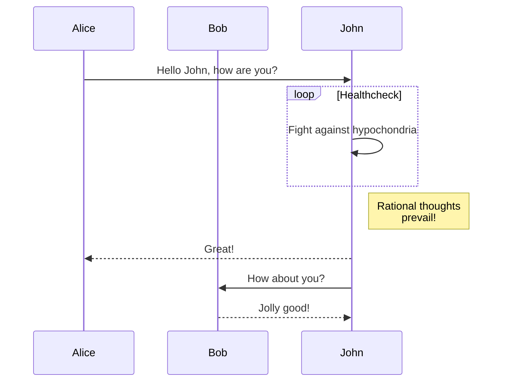
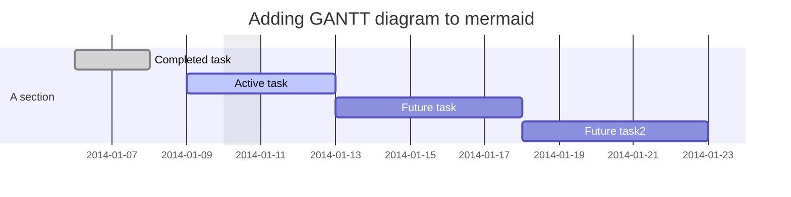
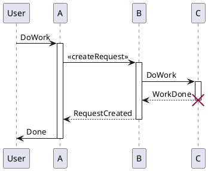
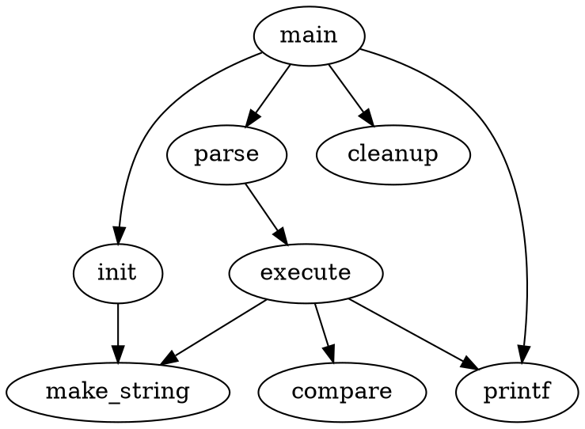

# List of Library for Commonmark Extension

## 2.16. Diagram

*Notes:*
- Your app should support the specific library or engine to draw the diagram
- You should specify particular language of the fenced code block and write the definition of your diagram within it.

### 2.16.1 Mermaid
*Notes:*
- It's implemented in showdown-mermaid.js
- Rendering diagrams of Flowchart or Sequence or Gantt
- Using [mermaid](https://github.com/knsv/mermaid)
- Check [mermaid doc](https://mermaidjs.github.io) for more information.
- Code inside `{ }` is optional

***Syntaxes***
- Flowchart syntax:

        ```mermaid {"align": "left | center | right", "codeblock": true | false}
        graph TD;
        <code content>
        ```

- Sequence diagram syntax:

        ```mermaid {"align": "left | center | right", "codeblock": true | false}
        sequenceDiagram
        <code content>
        ```

- Gantt diagram syntax:

        ```mermaid {"align": "left | center | right", "codeblock": true | false}
        gantt
        <code content>
        ```

***Showcases***

- Flowchart


- Sequence diagram



- Gantt diagram



### 2.16.2 Plantuml
*Notes:*
- It's implemented in showdown-plantuml.js, 
- Render diagrams of uml,
- Using [plantuml](https://plantuml.com),
- Check [plantuml website](https://plantuml.com/) fpr more information.
- Code inside `{ }` is optional

***Syntaxes***

    ```plantuml {"align": "left | center | right", "codeblock": true | false}
    @startuml
    <code content>
    @enduml
    ```

***Showcases***



### 2.16.3 Flowchart
*Notes:*
- It's implemented in showdown-flowchart.js
- Render diagrams of flowchart
- Using [flowchart.js](https://github.com/adrai/flowchart.js)
- Check [flowchart website](https://flowchart.js.org/) for more information.
- Code inside `{ }` is optional

***Syntaxes***

    ```flow {"align": "left | center | right", "codeblock": true | false}
    <code content>
    ```

***Syntaxes***

    ```flowchart {"align": "left | center | right", "codeblock": true | false}
    <code content>
    ```

***Showcases***

```flow  {"align":"center"}
st=>start: Start:>https://www.google.com[blank]
e=>end:>https://www.google.com
op1=>operation: My Operation
sub1=>subroutine: My Subroutine
cond=>condition: Yes
or No?:>https://www.google.com
io=>inputoutput: catch something...
para=>parallel: parallel tasks

st->op1->cond
cond(yes)->io->e
cond(no)->para
para(path1, bottom)->sub1(right)->op1
para(path2, top)->op1
```
***Showcases***

```flowchart {"align":"right"}
st=>start: Start
e=>end
op1=>operation: My Operation
sub1=>subroutine: My Subroutine
cond=>condition: Yes
or No?:>https://www.google.com
io=>inputoutput: catch something
st->op1->cond
cond(yes)->io->e
cond(no)->sub1(right)->op1
```

### 2.16.4 Graphviz's dot
*Notes:*
- It's implemented in showdown-viz.js
- Render diagrams of graphviz's dot 
- Using [viz.js](https://github.com/mdaines/viz.js).
- Code inside `{ }` is optional

***Syntaxes***

The \<engine name> of json's "engine" field value is 'circo', 'dot', 'neato', 'osage', 'twopi' in syntax language attribute.

    ```dot {"engine": "<engine name>", "align": "<align>"}
    <code content>
    ```

***Showcases***
- Dot example with dot engine:



<br>

- Dot example with circo engine:


### 2.16.5 Railroad diagrams
*Notes:*
- It's implemented in showdown-viz.js, 
- Render diagrams of railroad 
- Using [railroad-diagrams](https://github.com/tabatkins/railroad-diagrams).
- Code inside `{ }` is optional

***Syntaxes***

    ```railroad {"align": "left | center | right", "codeblock": true | false}
    <code content>
    ```

***Showcases***

```railroad {"align":"center"}
Diagram(
  Optional('+', 'skip'),
    Choice(0,
      NonTerminal('name-start char'),
      NonTerminal('escape')),
      ZeroOrMore(
        Choice(0,
          NonTerminal('name char'),
          NonTerminal('escape'))))
```

### 2.16.6 WaveDrom
*Notes:*
- It's implemented in showdown-viz.js, 
- Render diagrams of wavedrom 
- Using [wavedrom](https://github.com/wavedrom/wavedrom)
- Check [wavedrom website](https://wavedrom.com) for more information.
- Code inside `{ }` is optional

***Syntaxes***

    ```wavedrom {"align": "left | center | right", "codeblock": true | false}
    <code content>
    ```

***Showcases***

```wavedrom {"align":"center"}
{signal: [
  {name: 'clk', wave: 'p.....|...'},
  {name: 'dat', wave: 'x.345x|=.x', data: ['head', 'body', 'tail', 'data']},
  {name: 'req', wave: '0.1..0|1.0'},
  {},
  {name: 'ack', wave: '1.....|01.'}
]}
```

***Showcases***

```wavedrom {"align":"right"}
{ signal: [
  { name: "pclk", wave: 'p.......' },
  { name: "Pclk", wave: 'P.......' },
  { name: "nclk", wave: 'n.......' },
  { name: "Nclk", wave: 'N.......' },
  {},
  { name: 'clk0', wave: 'phnlPHNL' },
  { name: 'clk1', wave: 'xhlhLHl.' },
  { name: 'clk2', wave: 'hpHplnLn' },
  { name: 'clk3', wave: 'nhNhplPl' },
  { name: 'clk4', wave: 'xlh.L.Hx' },
]}
```

### 2.16.7 Vega and Vega-Lite
*Notes:*
- It's implemented in showdown-vega.js,
- Render diagrams of [Vega](https://github.com/vega/vega) and [Vega-Lite](https://github.com/vega/vega-lite)
- Using [vega-embed](https://github.com/vega/vega-embed),
- Check [vega website](https://vega.github.io/vega/) and [vega-lite website](https://vega.github.io/vega-lite) for more information.
- Code inside `{ }` is optional

***Syntaxes***

    ```vega {"align": "left | center | right", "codeblock": true | false}
    <code content>
    ```

***Syntaxes***

    ```vega-lite {"align": "left | center | right", "codeblock": true | false}
    <code content>
    ```

***Showcases***

- Vega example:

```vega {"align":"center"}
{
  "$schema": "https://vega.github.io/schema/vega/v5.json",
  "width": 200,
  "height": 200,
  "autosize": "none",

  "signals": [
    {
      "name": "startAngle", "value": 0,
      "bind": {"input": "range", "min": 0, "max": 6.29, "step": 0.01}
    },
    {
      "name": "endAngle", "value": 6.29,
      "bind": {"input": "range", "min": 0, "max": 6.29, "step": 0.01}
    },
    {
      "name": "padAngle", "value": 0,
      "bind": {"input": "range", "min": 0, "max": 0.1}
    },
    {
      "name": "innerRadius", "value": 0,
      "bind": {"input": "range", "min": 0, "max": 90, "step": 1}
    },
    {
      "name": "cornerRadius", "value": 0,
      "bind": {"input": "range", "min": 0, "max": 10, "step": 0.5}
    },
    {
      "name": "sort", "value": false,
      "bind": {"input": "checkbox"}
    }
  ],

  "data": [
    {
      "name": "table",
      "values": [
        {"id": 1, "field": 4},
        {"id": 2, "field": 6},
        {"id": 3, "field": 10},
        {"id": 4, "field": 3},
        {"id": 5, "field": 7},
        {"id": 6, "field": 8}
      ],
      "transform": [
        {
          "type": "pie",
          "field": "field",
          "startAngle": {"signal": "startAngle"},
          "endAngle": {"signal": "endAngle"},
          "sort": {"signal": "sort"}
        }
      ]
    }
  ],

  "scales": [
    {
      "name": "color",
      "type": "ordinal",
      "domain": {"data": "table", "field": "id"},
      "range": {"scheme": "category20"}
    }
  ],

  "marks": [
    {
      "type": "arc",
      "from": {"data": "table"},
      "encode": {
        "enter": {
          "fill": {"scale": "color", "field": "id"},
          "x": {"signal": "width / 2"},
          "y": {"signal": "height / 2"}
        },
        "update": {
          "startAngle": {"field": "startAngle"},
          "endAngle": {"field": "endAngle"},
          "padAngle": {"signal": "padAngle"},
          "innerRadius": {"signal": "innerRadius"},
          "outerRadius": {"signal": "width / 2"},
          "cornerRadius": {"signal": "cornerRadius"}
        }
      }
    }
  ]
}
```

<br>

- Vega-Lite example:

```vega-lite {"align":"right"}
{
  "$schema": "https://vega.github.io/schema/vega-lite/v4.json",
  "description": "Plots two functions using a generated sequence.",
  "width": 300,
  "height": 150,
  "data": {
    "sequence": {
      "start": 0,
      "stop": 12.7,
      "step": 0.1,
      "as": "x"
    }
  },
  "transform": [
    {
      "calculate": "sin(datum.x)",
      "as": "sin(x)"
    },
    {
      "calculate": "cos(datum.x)",
      "as": "cos(x)"
    },
    {
      "fold": ["sin(x)", "cos(x)"]
    }
  ],
  "mark": "line",
  "encoding": {
    "x": {
      "type": "quantitative",
      "field": "x"
    },
    "y": {
      "field": "value",
      "type": "quantitative"
    },
    "color": {
      "field": "key",
      "type": "nominal",
      "title": null
    }
  }
}
```

### 2.16.8 Network Sequence
*Notes:*
- It's implemented in showdown-sequence.js, 
- Render diagrams of sequence 
- Using [js-sequence-diagrams](https://github.com/bramp/js-sequence-diagrams).
- Code inside `{ }` is optional

***Syntaxes***

The \<theme name> of json's "theme" field value is "hand" or "simple" in syntax language attribute;

    ```sequence {"theme": "<theme name>", "align": "<align>"}
    <code content>
    ```

***Showcases***

- Sequence example with hand theme:

```sequence {"theme":"hand", "align":"center"}
Alice->Bob: Hello Bob, how are you?
Note right of Bob: Bob thinks
Bob-->Alice: I am good thanks!
```

<br>

- Sequence example with simple theme:

```sequence {"theme":"simple", "align":"right"}
Alice->Bob: Hello Bob, how are you?
Note right of Bob: Bob thinks
Bob-->Alice: I am good thanks!
```

---
