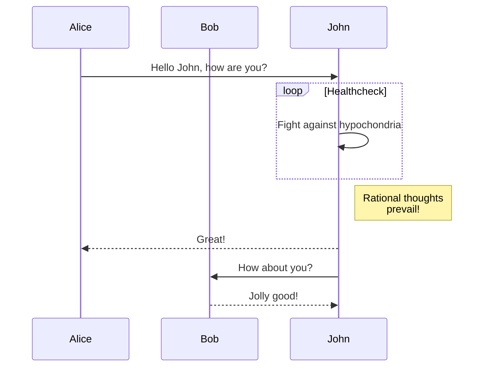
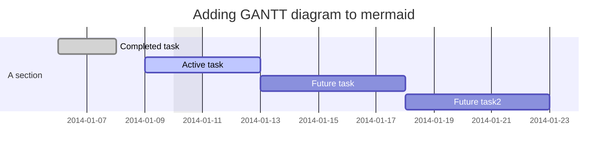
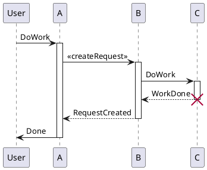
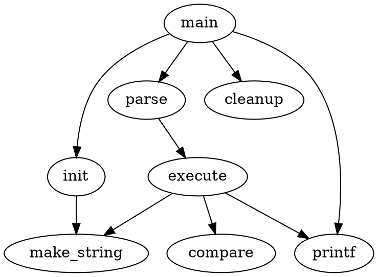

# Complete Markdown Cheatsheet

>> this is a quick guide [^1] for Markdown
[^1]: [Mastering Markdown](https://guides.github.com/features/mastering-markdown/).

# 1. Basic Markdown
---
## 1.1. Heading

***Syntaxes***

```md
# h1 Heading
## h2 Heading
### h3 Heading
#### h4 Heading
##### h5 Heading
###### h6 Heading
```

***Showcases***

# h1 Heading
## h2 Heading
### h3 Heading
#### h4 Heading
##### h5 Heading
###### h6 Heading

***Alternative Syntaxes***

```md
h1 Heading
===================
h2 Heading
-------------------
```

***Showcases***

h1 Heading
========
h2 Heading
-------------

*Notes:*
- Always put a space between `#` and the heading name
- Heading with  `===` or `---` are not recommended

---
## 1.2. Paragraphs

*Notes:*
- To create paragraphs, use a blank line to separate one or more lines of text.
- Don't ident paragraphs with spaces or tabs

***Syntaxes***

```md
This is the first paragraph.

This is the second paragraph
```

***Showcases***

This is the first paragraph.

This is the second paragraph

---
## 1.3 Line Break

*Notes:*
- To create a line break, end a line with two or more spaces, and then type return
- *Or* use the `<br>` HTML tag

***Syntaxes***

```md
This is the first line.  
And this is the second line.
```

***Showcases***

This is the first line.  
And this is the second line.

***Alternative Syntaxes***

```md
First line with the HTML tag after.<br>
And the next line.
```

***Showcases***

First line with the HTML tag after.<br>
And the next line.

---
## 1.4. Emphasis

***Syntaxes***

```md
**This is bold text**
__This is bold text__
*This is italic text*
_This is italic text_
We have **bold***italic*
This text is ***really important***
This text is ___really important___
This text is __*really important*__
This text is **_really important_**
```

***Showcases***

**This is bold text**
__This is bold text__
*This is italic text*
_This is italic text_
We have **bold***italic*
This text is ***really important***
This text is ___really important___
This text is __*really important*__
This text is **_really important_**

---
## 1.5. Blockquotes

*Notes:*
- Space is needed after the marker `>`;
- You could just add only one `>` at the first line;
- Blockquotes can be nested
- Blockquotes can contain multiple paragraphs. Add a >  between the paragraphs.
- Blockquotes can contain other Markdown formatted elements. But not all elements can be used.

***Syntaxes***

```md
> Blockquotes can also be nested...
>> ...by using additional greater-than signs right next to each other...
> > > ...or with spaces between arrows.
```

***Showcases***

> Blockquotes can also be nested...
>> ...by using additional greater-than signs right next to each other...
> > > ...or with spaces between arrows.

***Syntaxes***

```md
> Dorothy followed her through many of the beautiful rooms in her castle.
>
> The Witch bade her clean the pots and kettles and sweep the floor and keep the fire fed with wood.
```

***Showcases***

> Dorothy followed her through many of the beautiful rooms in her castle.
>
> The Witch bade her clean the pots and kettles and sweep the floor and keep the fire fed with wood.

***Syntaxes***

```md
> #### The quarterly results look great!
>
> - Revenue was off the chart.
> - Profits were higher than ever.
>
>  *Everything* is going according to **plan**.
```

***Showcases***

> #### The quarterly results look great!
>
> - Revenue was off the chart.
> - Profits were higher than ever.
>
>  *Everything* is going according to **plan**.

---
## 1.6. Lists
### 1.6.1. Unordered

***Syntaxes***

```md

+ To start a list, there should be an empty line above
+ Create a list by starting a line with `+`, `-`, or `*`
- Changing the sign will add a linespace
+ Add text under an item  
This is a text under an item. Notice that there are two spaces at the end above.
- Sub-lists are made by indenting 2 spaces:
  * Item 2a
  * Item 2b
* Item 3

To end a list, there should be one empty line above.
```

***Showcases***

+ To start a list, there should be an empty line above
+ Create a list by starting a line with `+`, `-`, or `*`
- Changing the sign will add a linespace
+ Add text under an item  
This is a text under an item. Notice that there are two spaces at the end above.
- Sub-lists are made by indenting 2 spaces:
  * Item 2a
  * Item 2b
* Item 3

To end a list, there should be one empty line above.

### 1.6.2. Ordered

***Syntaxes***

```md
1. Item 1
1. Item 2  
Notice that the sequence number is irrelevant. 
Markdown will change the sequence automatically when renderring. 
Notice that there are two spaces at the end above to make a new text under item.
3. Sub-lists are made by indenting 4 spaces
    1. Item 3a
    2. Item 3b
8. Any number for item 4
```

***Showcases***

1. Item 1
1. Item 2  
Notice that the sequence number is irrelevant.  
Markdown will change the sequence automatically when renderring.  
Notice that there are two spaces at the end above to make a new text under item.
3. Sub-lists are made by indenting 4 spaces
    1. Item 3a
    2. Item 3b
8. Any number for item 4

***Syntaxes***

```md
57. will started with offset 57
1. so it will be 58
```

***Showcases***

57. will started with offset 57
1. so it will be 58

---

## 1.7. Elements in Lists

*Notes:*
- To add another element in a list while preserving the continuity of the list, indent the element four spaces or one tab

***Syntaxes***

```md
* This is the first list item.
* Here's the second list item.
    I need to add another paragraph below the second list item.
* And here's the third list item.
```

***Showcases***

* This is the first list item.
* Here's the second list item.
 I need to add another paragraph below the second list item.
* And here's the third list item.


***Showcases***

*   This is the first list item.
*   Here's the second list item.

    I need to add another paragraph below the second list item.

*   And here's the third list item.

***Showcases***

*   This is the first list item.
*   Here's the second list item.

    > A blockquote would look great below the second list item.

*   And here's the third list item.


***Syntaxes***

```md
1.  Open the file containing the Linux mascot.
2.  Linux mascot called Tux.
    
3.  Tux is cool.
```

***Showcases***

1.  Open the file containing the Linux mascot.
2.  Linux mascot called Tux.
    
3.  Tux is cool.


*But, for text element in ordered list, add five spaces*

1.   This is the first list item.
2.   Here's the second list item.

     I need to add another paragraph below the second list item.

3.   And here's the third list item.

*But, for quote in ordered list, add five spaces*

1. This is the first list item.
3.   Here's the second list item.

     > A blockquote would look great below the second list item.

5.   And here's the third list item.

*But, for code blocks in the lists, add eight spaces or two tabs.*

1.  Open the file.
2.  Find the following code block on line 21:

        <html>
          <head>
            <title>Test</title>
          </head>

3.  Update the title to match the name of your website.


---
## 1.8. Code

*Notes:*
- Inline codes is written inside \` \`
- or idented by add four spaces or one tab before

***Syntaxes***

```md
This is inline `code`.
```

***Showcases***

This is inline `code`.

***Syntaxes***

```md
    // Some comments
    line 1 of code
    line 2 of code
    line 3 of code
```

***Showcases***

    // Some comments
    line 1 of code
    line 2 of code
    line 3 of code

***Syntaxes***

```md
    <html>
      <head>
        <title>Test</title>
      </head>
```

***Showcases***

    <html>
      <head>
        <title>Test</title>
      </head>

---
## 1.9. Links

**Example**

This is [link](http://example.com/)
This is [link with title](http://example.com/ "title text!")

*Or, directly put the link*

http://example.com/
fake@example.com

*Or with `<>`*

<https://www.markdownguide.org>
<fake@example.com>

*But, to prevent automated linking*

 `http://www.example.com`

*Or add emphasize*

I love supporting the **[EFF](https://eff.org)**.
This is the *[Markdown Guide](https://www.markdownguide.org)*.
See the section on [`code`](#code).

## 1.11. Reference-style Links

**Example: The First Part**

I know [Indonesia][1]
I also know [etymology of Indonesia] [2]
I knew [History of Indonesia][3]

**Example: The Second Part**

[1]: <https://en.wikipedia.org/wiki/Indonesia>
[2]: https://en.wikipedia.org/wiki/Indonesia#Etymology "Etymology of Indonesia"
[3]: https://en.wikipedia.org/wiki/Indonesia#History 'History of Indonesia'

*Or, put reference in text*

It was a [hobbit-hole][hh], and that means comfort.

[hh]: <https://en.wikipedia.org/wiki/Hobbit#Lifestyle> "Hobbit lifestyles"

*But, be careful with spaces in the links, put `%20` as space*

[example %20 link](https://www.example.com/my%20great%20page) 
[example without %20](https://www.example.com/my great page) 

---
## 1.10. Images

*Notes:*
- It is not recommended to use image links in reference format. Some apps will not preview those images.
- Specifying size of image is supported only in some extended markdown (such as *markdown-it*).

***Syntaxes***

```md


```

***Showcases***


***Syntaxes***
```md
![Image Alt Text][id1]
![Image Alt Text][id2]

[id1]: /url/to/image.png "Optional Text"
[id2]: /url/to/image.png
```

***Showcases***

![Wikipedia][id1]
![Wikipedia Logo][id2]

[id1]: https://upload.wikimedia.org/wikipedia/commons/thumb/d/de/Wikipedia_Logo_1.0.png/240px-Wikipedia_Logo_1.0.png  "Wikipedia Logo"
[id2]: https://upload.wikimedia.org/wikipedia/commons/thumb/d/de/Wikipedia_Logo_1.0.png/240px-Wikipedia_Logo_1.0.png

---
## 1.11. Escaping Characters
*Note:*
- add a backslash `\` in front of the character.

**Example**

\* star
\\ backslash itself
\` backtick
\{ \} curly braces
\! exclamation mark

---
## 1.12. HTML Code

**Example**

This **word** is bold. This <em>word</em> is italic.

---

## 1.13. Horizontal Rules

**Example**

___

---

***

# 2. Extended Markdown
---

## 2.1. Heading ID
### My Great Heading {#heading-ids}

In HTML:
<h3 id="custom-id">My Great Heading</h3>

Link to [Heading IDs](#heading-ids) or
[Heading IDs](https://www.markdownguide.org/extended-syntax#heading-ids)

----
## 2.2. Code Fencing and Highlighting
*Notes:*
- We can make block code fences without need to be idented
- `lang` is optional to specify the language of the code; if not specified, the app won't highlight the code;
- We need one empty line before

***Syntaxes***

```
    ```
    This is a fenced code block.
    ```
```

***Syntaxes***

```
    ~~~
    This is another fenced code block.
    ~~~
```

***Showcases***

```
This is a fenced code block.
```

~~~
No language indicated, so no syntax highlighting.
s = "There is no highlighting for this."
But let's throw in a <b>tag</b>.
~~~


***Showcases*** (`javascript`)

```javascript
var s = "JavaScript syntax highlighting";
alert(s);
```

***Showcases*** (`python`)

```python
def function():
    #indenting works just fine in the fenced code block
    s = "Python syntax highlighting"
    print s
```

***Showcases*** (`ruby`)

```ruby
require 'redcarpet'
markdown = Redcarpet.new("Hello World!")
puts markdown.to_html
```

---
## 2.3. Tables

*Notes:*
- we can set alignment in table with a colon (:)
- we can add formatting text, links, code and HTML character code, but not: heading, headings, blockquotes, lists, horizontal rules, images, HTML tags, or fenced code

***Syntaxes***

```md
| Option | Description |
| ------ | ----------- |
| data   | path to data files to supply the data that will be passed into templates. |
| engine | engine to be used for processing templates. Handlebars is the default. |
| ext    | extension to be used for dest files. |
```

***Showcases***

| Option | Description |
| ------ | ----------- |
| data   | path to data files to supply the data that will be passed into templates. |
| engine | engine to be used for processing templates. Handlebars is the default. |
| ext    | extension to be used for dest files. |

***Syntaxes***

```md
| Syntax      | Description | Test Text is long    |
| :---        |    :----:   |          ---: |
| Header from      | Title       | Here's this  is |
| Paragraph   | Text        | And more   |
```

***Showcases***

| Syntax      | Description | Test Text is long    |
| :---        |    :----:   |          ---: |
| Header from      | Title       | Here's this  is |
| Paragraph   | Text        | And more   |

***Syntaxes***

```md
| Syntax      | Description | Test Text is long    |
| :---        |    :----:   |          ---: |
| [Example](https://www.example.com/)      | **Title**       | `Here's this  is` |
| Paragraph   | Text        | And more   |
```

***Showcases***

| Syntax      | Description | Test Text is long    |
| :---        |    :----:   |          ---: |
| [Example](https://www.example.com/)      | **Title**       | `Here's this  is` |
| Paragraph   | Text        | And more   |

---
## 2.4. Footnote
**Example: The First Part**
Here's a simple footnote,[^1] and here's a longer one,[^bignote], and [^withcode]

**Example: The Second Part**
[^1]: This is the first footnote.
[^bignote]: Here's one with multiple paragraphs.
For example like this
[^withcode]: `code` or code in paragrahps
`code and codes`

*Or add inline footnote*
Another example of footnote 1 link[^first] and footnote 2 link[^second].
Or to add inline footnote^[Text of inline footnote] definition.

*Or duplictade reference*
This duplicated footnote reference[^second].

[^first]: Footnote **can have markup**
and multiple paragraphs.
[^second]: Another footnote text.

---
## 2.4. Strikethrough, Highlighting, Underline

**Example of strikethrough**
~~strikethrough~~
In HTML: <s>strikethrough</s>

**Example of mark/highlighting**
==marked text==
in HTML: <mark>marked text</mark>

**Example of underline**
_underline_
in HTML: <u>underline</u>

---
## 2.5. Task Lists
**Example**
- [x] Write the press release
- [ ] Update the website
- [ ] Contact the media

---
## 2.6. Definition Lists
**Example**

First Term
: This is the definition of the first term.

Second Term
: This is one definition of the second term.
: This is another definition of the second term.

In HTML:
<dl>
  <dt>First Term</dt>
  <dd>This is the definition of the first term.</dd>
  <dt>Second Term</dt>
  <dd>This is one definition of the second term. </dd>
  <dd>This is another definition of the second term.</dd>
</dl>

*Or *

Term 1
:   Definition 1
with lazy continuation.

Term 2 with *inline markup*
:   Definition 2
        { some code, part of Definition 2 }

    Third paragraph of definition 2.

*Or in compact style:*

Term 1
  ~ Definition 1

Term 2
  ~ Definition 2a
  ~ Definition 2b

---
## 2.7. Emojies

**Emoji can be copy pasted**

Gone camping! ⛺ Be back soon.
That is so funny! 😂

*Or, use markdown*

Gone camping! :tent: Be back soon.
That is so funny! :joy:
> Classic markup: :wink: :crush: :cry: :tear: :laughing: :yum:
>
> Shortcuts (emoticons): :-) :-( 8-) ;)

---
## 2.9. Typographic replacements

**Example**

(c) (C) (r) (R) (tm) (TM) (p) (P) +-
test.. test... test..... test?..... test!....
!!!!!! ???? ,,  -- ---
"Smartypants, double quotes" and 'single quotes'

---
## 2.10. Superscript and Subscript
**Example Superscript**
x^2^
In HTML: x<sup>2</sup>

**Example Subscript** 
H~2~O
In HTML: H<sub>2</sub>O

---
## 2.11. Inserted Text

**Example**
++Inserted text++
In HTML: <ins>This text has been inserted</ins>

---
## 2.12. Abbreviations
**Example**

The "HTML" specification is maintained by the "W3C".
*[HTML]: Hyper Text Markup Language
*[W3C]: World Wide Web Consortium

In HTML:
The <abbr title="Hyper Text Markup Language">HTML</abbr> specification is maintained by the <abbr title="World Wide Web Consortium">W3C</abbr>.

---
## 2.13. HTML Entities and Character Codes

**Example**

&copy; &  &uml; &trade; &iexcl; &pound;
&amp; &lt; &gt; &yen; &euro; &reg; &plusmn; &para; &sect; &brvbar; &macr; &laquo; &middot; 
&#124;

*Or*

X&sup2; Y&sup3; &frac34; &frac14;  &times;  &divide;   &raquo;

*Or*

18&ordm;C  &quot;  &apos;

---
## 2.14. Latex
*Note:*
- Sometimes with `\(` and `\)` brackets

**Example**

$E=mc^2$

$$\(\sqrt{3x-1}+(1+x)^2\)$$
                    
$$\sin(\alpha)^{\theta}=\sum_{i=0}^{n}(x^i + \cos(f))$$

*Or, inline*

The Gamma function satisfying  $\Gamma(n) = (n-1)!\quad\forall n\in\mathbb N$ is via the Euler integral

---
## 2.15. Mentions, Tag, Font Awesome
*Note:*
- with `fa-something`:

**Example**

This is @mentions
This is #tags 
This is  <del>tags</del>
This is font awesome :fa-star: 

---
## 2.16. Diagram

*Notes:*
- Your app should support the specific library or engine to draw the diagram
- You should specify particular language of the fenced code block and write the definition of your diagram within it.

### 2.16.1 Mermaid
*Notes:*
- It's implemented in showdown-mermaid.js
- Rendering diagrams of Flowchart or Sequence or Gantt
- Using [mermaid](https://github.com/knsv/mermaid)
- Check [mermaid doc](https://mermaidjs.github.io) for more information.
- Code inside `{ }` is optional

***Syntaxes***
- Flowchart syntax:

        ```mermaid {"align": "left | center | right", "codeblock": true | false}
        graph TD;
        <code content>
        ```

- Sequence diagram syntax:

        ```mermaid {"align": "left | center | right", "codeblock": true | false}
        sequenceDiagram
        <code content>
        ```

- Gantt diagram syntax:

        ```mermaid {"align": "left | center | right", "codeblock": true | false}
        gantt
        <code content>
        ```

***Showcases***

- Flowchart


- Sequence diagram



- Gantt diagram



### 2.16.2 Plantuml
*Notes:*
- It's implemented in showdown-plantuml.js, 
- Render diagrams of uml,
- Using [plantuml](http://plantuml.com),
- Check [plantuml website](http://plantuml.com/) fpr more information.
- Code inside `{ }` is optional

***Syntaxes***

    ```plantuml {"align": "left | center | right", "codeblock": true | false}
    @startuml
    <code content>
    @enduml
    ```

***Showcases***



### 2.16.3 Flowchart
*Notes:*
- It's implemented in showdown-flowchart.js
- Render diagrams of flowchart
- Using [flowchart.js](https://github.com/adrai/flowchart.js)
- Check [flowchart website](http://flowchart.js.org/) for more information.
- Code inside `{ }` is optional

***Syntaxes***

    ```flow {"align": "left | center | right", "codeblock": true | false}
    <code content>
    ```

***Syntaxes***

    ```flowchart {"align": "left | center | right", "codeblock": true | false}
    <code content>
    ```

***Showcases***

```flow  {"align":"center"}
st=>start: Start:>http://www.google.com[blank]
e=>end:>http://www.google.com
op1=>operation: My Operation
sub1=>subroutine: My Subroutine
cond=>condition: Yes
or No?:>http://www.google.com
io=>inputoutput: catch something...
para=>parallel: parallel tasks

st->op1->cond
cond(yes)->io->e
cond(no)->para
para(path1, bottom)->sub1(right)->op1
para(path2, top)->op1
```
***Showcases***

```flowchart {"align":"right"}
st=>start: Start
e=>end
op1=>operation: My Operation
sub1=>subroutine: My Subroutine
cond=>condition: Yes
or No?:>http://www.google.com
io=>inputoutput: catch something
st->op1->cond
cond(yes)->io->e
cond(no)->sub1(right)->op1
```

### 2.16.4 Graphviz's dot
*Notes:*
- It's implemented in showdown-viz.js
- Render diagrams of graphviz's dot 
- Using [viz.js](https://github.com/mdaines/viz.js).
- Code inside `{ }` is optional

***Syntaxes***

The \<engine name> of json's "engine" field value is 'circo', 'dot', 'neato', 'osage', 'twopi' in syntax language attribute.

    ```dot {"engine": "<engine name>", "align": "<align>"}
    <code content>
    ```

***Showcases***
- Dot example with dot engine:



<br>

- Dot example with circo engine:


### 2.16.5 Railroad diagrams
*Notes:*
- It's implemented in showdown-viz.js, 
- Render diagrams of railroad 
- Using [railroad-diagrams](https://github.com/tabatkins/railroad-diagrams).
- Code inside `{ }` is optional

***Syntaxes***

    ```railroad {"align": "left | center | right", "codeblock": true | false}
    <code content>
    ```

***Showcases***

```railroad {"align":"center"}
Diagram(
  Optional('+', 'skip'),
    Choice(0,
      NonTerminal('name-start char'),
      NonTerminal('escape')),
      ZeroOrMore(
        Choice(0,
          NonTerminal('name char'),
          NonTerminal('escape'))))
```

### 2.16.6 WaveDrom
*Notes:*
- It's implemented in showdown-viz.js, 
- Render diagrams of wavedrom 
- Using [wavedrom](https://github.com/wavedrom/wavedrom)
- Check [wavedrom website](https://wavedrom.com) for more information.
- Code inside `{ }` is optional

***Syntaxes***

    ```wavedrom {"align": "left | center | right", "codeblock": true | false}
    <code content>
    ```

***Showcases***

```wavedrom {"align":"center"}
{signal: [
  {name: 'clk', wave: 'p.....|...'},
  {name: 'dat', wave: 'x.345x|=.x', data: ['head', 'body', 'tail', 'data']},
  {name: 'req', wave: '0.1..0|1.0'},
  {},
  {name: 'ack', wave: '1.....|01.'}
]}
```

***Showcases***

```wavedrom {"align":"right"}
{ signal: [
  { name: "pclk", wave: 'p.......' },
  { name: "Pclk", wave: 'P.......' },
  { name: "nclk", wave: 'n.......' },
  { name: "Nclk", wave: 'N.......' },
  {},
  { name: 'clk0', wave: 'phnlPHNL' },
  { name: 'clk1', wave: 'xhlhLHl.' },
  { name: 'clk2', wave: 'hpHplnLn' },
  { name: 'clk3', wave: 'nhNhplPl' },
  { name: 'clk4', wave: 'xlh.L.Hx' },
]}
```

### 2.16.7 Vega and Vega-Lite
*Notes:*
- It's implemented in showdown-vega.js,
- Render diagrams of [Vega](https://github.com/vega/vega) and [Vega-Lite](https://github.com/vega/vega-lite)
- Using [vega-embed](https://github.com/vega/vega-embed),
- Check [vega website](https://vega.github.io/vega/) and [vega-lite website](https://vega.github.io/vega-lite) for more information.
- Code inside `{ }` is optional

***Syntaxes***

    ```vega {"align": "left | center | right", "codeblock": true | false}
    <code content>
    ```

***Syntaxes***

    ```vega-lite {"align": "left | center | right", "codeblock": true | false}
    <code content>
    ```

***Showcases***

- Vega example:

```vega {"align":"center"}
{
  "$schema": "https://vega.github.io/schema/vega/v5.json",
  "width": 200,
  "height": 200,
  "autosize": "none",

  "signals": [
    {
      "name": "startAngle", "value": 0,
      "bind": {"input": "range", "min": 0, "max": 6.29, "step": 0.01}
    },
    {
      "name": "endAngle", "value": 6.29,
      "bind": {"input": "range", "min": 0, "max": 6.29, "step": 0.01}
    },
    {
      "name": "padAngle", "value": 0,
      "bind": {"input": "range", "min": 0, "max": 0.1}
    },
    {
      "name": "innerRadius", "value": 0,
      "bind": {"input": "range", "min": 0, "max": 90, "step": 1}
    },
    {
      "name": "cornerRadius", "value": 0,
      "bind": {"input": "range", "min": 0, "max": 10, "step": 0.5}
    },
    {
      "name": "sort", "value": false,
      "bind": {"input": "checkbox"}
    }
  ],

  "data": [
    {
      "name": "table",
      "values": [
        {"id": 1, "field": 4},
        {"id": 2, "field": 6},
        {"id": 3, "field": 10},
        {"id": 4, "field": 3},
        {"id": 5, "field": 7},
        {"id": 6, "field": 8}
      ],
      "transform": [
        {
          "type": "pie",
          "field": "field",
          "startAngle": {"signal": "startAngle"},
          "endAngle": {"signal": "endAngle"},
          "sort": {"signal": "sort"}
        }
      ]
    }
  ],

  "scales": [
    {
      "name": "color",
      "type": "ordinal",
      "domain": {"data": "table", "field": "id"},
      "range": {"scheme": "category20"}
    }
  ],

  "marks": [
    {
      "type": "arc",
      "from": {"data": "table"},
      "encode": {
        "enter": {
          "fill": {"scale": "color", "field": "id"},
          "x": {"signal": "width / 2"},
          "y": {"signal": "height / 2"}
        },
        "update": {
          "startAngle": {"field": "startAngle"},
          "endAngle": {"field": "endAngle"},
          "padAngle": {"signal": "padAngle"},
          "innerRadius": {"signal": "innerRadius"},
          "outerRadius": {"signal": "width / 2"},
          "cornerRadius": {"signal": "cornerRadius"}
        }
      }
    }
  ]
}
```

<br>

- Vega-Lite example:

```vega-lite {"align":"right"}
{
  "$schema": "https://vega.github.io/schema/vega-lite/v4.json",
  "description": "Plots two functions using a generated sequence.",
  "width": 300,
  "height": 150,
  "data": {
    "sequence": {
      "start": 0,
      "stop": 12.7,
      "step": 0.1,
      "as": "x"
    }
  },
  "transform": [
    {
      "calculate": "sin(datum.x)",
      "as": "sin(x)"
    },
    {
      "calculate": "cos(datum.x)",
      "as": "cos(x)"
    },
    {
      "fold": ["sin(x)", "cos(x)"]
    }
  ],
  "mark": "line",
  "encoding": {
    "x": {
      "type": "quantitative",
      "field": "x"
    },
    "y": {
      "field": "value",
      "type": "quantitative"
    },
    "color": {
      "field": "key",
      "type": "nominal",
      "title": null
    }
  }
}
```

### 2.16.8 Network Sequence
*Notes:*
- It's implemented in showdown-sequence.js, 
- Render diagrams of sequence 
- Using [js-sequence-diagrams](https://github.com/bramp/js-sequence-diagrams).
- Code inside `{ }` is optional

***Syntaxes***

The \<theme name> of json's "theme" field value is "hand" or "simple" in syntax language attribute;

    ```sequence {"theme": "<theme name>", "align": "<align>"}
    <code content>
    ```

***Showcases***

- Sequence example with hand theme:

```sequence {"theme":"hand", "align":"center"}
Alice->Bob: Hello Bob, how are you?
Note right of Bob: Bob thinks
Bob-->Alice: I am good thanks!
```

<br>

- Sequence example with simple theme:

```sequence {"theme":"simple", "align":"right"}
Alice->Bob: Hello Bob, how are you?
Note right of Bob: Bob thinks
Bob-->Alice: I am good thanks!
```

---

## 2.17. Table of Content Generation

**Example**

[TOC]

*Or*

[[TOC]]

*Or* 

[[_TOC_]]

---
## 2.18. Admonition

**Example**

!!! note

    This is the **note** admonition body

    !!! danger Danger Title
        This is the **danger** admonition body
		
--- 

## 2.19. Attributes

**Example**

item **bold red**{style="color:red"}
in HTML: item <strong style="color:red;">bold red</strong>

---
## 2.13. Custom Containers or Alerts
*Notes:*
- Some engine such as `Markdown-it`, you can add some alert text.
- Available variants:

```
alert-primary
alert-secondary
alert-success
alert-info
alert-warning
alert-danger
alert-light
alert-dark
```

***Syntaxes***

```md
::: alert-info

This is an info text.

:::

::: alert-danger

This is a danger text.

:::
```

***Showcases***

::: alert-warning
*here be dragons*
:::

in  HTML
<div class="alert-warning">
<p><em>here be dragons</em></p>
</div>

---